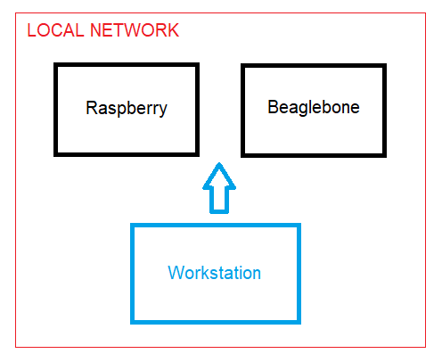

# Getting Started with Ansible
This repository was prepared based on [Getting Started with Ansible](https://youtube.com/playlist?list=PLT98CRl2KxKEUHie1m24-wkyHpEsa4Y70) playlist published at [Learn Linux TV](https://www.youtube.com/@LearnLinuxTV) youtube channel. It was part of my first steps in learning Ansible. 

As a complement to the content available on youtube playlist, an Ansible playbook was prepared to deploy a kubernetes cluster on embedded devices (raspberry and beaglebone) using rancher k3s.

Requirements:
- Git client
- Ansible
- OpenSSH
- Host and Server machines/VMs running Debian based distribution

To follow this tutorial please clone the git repository:
```sh
git clone ${PROJECT_REPOS_URL}
cd ${PROJECT_REPOS_NAME}
export REPOSITORY_PATH=$(pwd)
```

## 1) Infrastructure setup
In this guide we use 2 single board computers running debian based distributions as server nodes:
- 1x Raspberry Pi 3 Model B: `Raspbian GNU/Linux 11 (bullseye)`
- 1x Beaglebone Black: `Debian GNU/Linux 10 (buster)`

Futhermore, a Ubuntu workstation (Windows WSL2 - Ubuntu 20.04.5 LTS) is used as management environment. The infrastructure setup is presented next:



To execute the commands in this guide, please export the following variables based on your infrastructure setup:
```sh
export SERVER1_USER="write your server user"
export SERVER1_IP="write your server ip"
export SERVER2_USER="write your server user"
export SERVER2_IP="write your server ip"
```

### 1.1) SSH to server nodes
Ansible use SSH (OpenSSH) for communication with the server/VM instances.
- Create the ssh keys:
```sh
cd ${REPOSITORY_PATH}/
mkdir .ssh/
ssh-keygen -t ed25519 -f ./.ssh/learning_ansible_ssh_key -C "Ansible Getting Started" 
```

- Install keys on the server instance
```sh
cd ${REPOSITORY_PATH}/
ssh-copy-id -i ./.ssh/learning_ansible_ssh_key
.pub ${SERVER1_USER}@${SERVER1_IP}
ssh-copy-id -i ./.ssh/learning_ansible_ssh_key
.pub ${SERVER2_USER}@${SERVER2_IP}
```

- Open ssh connection to server using the keys:
```sh
cd ${REPOSITORY_PATH}/
ssh -i ./.ssh/learning_ansible_ssh_key ${SERVER1_USER}@${SERVER1_IP}
ssh -i ./.ssh/learning_ansible_ssh_key ${SERVER2_USER}@${SERVER2_IP}
```

## 2) Ansible setup and ad-hoc commands
### 2.1) Ansible install:
```sh
sudo apt update
sudo apt install ansible
```

### 2.2) Ansible inventory file
Create the inventory file including the IP addresses of all the hosts we want to manage using Ansible:
```sh
cd ${REPOSITORY_PATH}/ansible
touch inventory-v1
echo ${SERVER1_USER}@${SERVER1_IP} > inventory-v1
echo ${SERVER2_USER}@${SERVER2_IP} >> inventory-v1
```
### 2.3) Ansible status check
Test the connection to each of the servers included in the inventory file.
```sh
cd ${REPOSITORY_PATH}/ansible
ansible all --key-file ../.ssh/learning_ansible_ssh_key -i inventory-v1 -m ping
```
If the connection was successfully stablished, each server shows a response that seems like the following:
```
${SERVER1_USER}@${SERVER1_IP} | SUCCESS => {
    "ansible_facts": {
        "discovered_interpreter_python": "/usr/bin/python"
    },
    "changed": false,
    "ping": "pong"
}
```
### 2.4) Ansible config and ad-hoc commands
Let's create some default configuraton used by Ansible when executing any command.
```sh
cd ${REPOSITORY_PATH}/ansible
cat << EOF > ansible.cfg
[defaults]
inventory = inventory-v1
private_key_file = ../.ssh/learning_ansible_ssh_key
EOF
```
> The default `ansible.cfg` file is available at `/etc/ansible/ansible.cfg`. 

Test the default config. Now we dont need to pass the `--private-key` and `-i` parameters to ansible command:
```sh
cd ${REPOSITORY_PATH}/ansible
ansible all -m ping
```

> The following ad-hoc commands are useful to list information about Ansible hosts:
> - List hosts: `ansible all --list-hosts`
> - Get info about hosts: `ansible all -m gather_facts`
> - Get info about a single host: `ansible all -m gather_facts --limit ${SERVER1_USER}@${SERVER1_IP}`

## 3) Ansible ad-hoc elevated commands
Using `--become` and `--become-method=sudo` it's possible to execute `sudo` pivileged commands on remote hosts. Furthermore, `--ask-become-pass` can be used to pass the `root` user password. Example:
```sh
cd ${REPOSITORY_PATH}/ansible
ansible all -m apt -a update_cache=true --become --become-method=sudo --ask-become-pass
```
> References: 
> - [Privilege escalation: become](https://docs.ansible.com/ansible/latest/playbook_guide/playbooks_privilege_escalation.html#understanding-privilege-escalation-become)
> - [Ansible `apt` module](https://docs.ansible.com/ansible/latest/collections/ansible/builtin/apt_module.html#ansible-builtin-apt-module-manages-apt-packages)

### 3.1) Ad-hoc package install
Installing `nano` package on remote hosts:
```sh
cd ${REPOSITORY_PATH}/ansible
ansible all --become --become-method=sudo --ask-become-pass -m apt -a name=nano
```

## 4) Ansible playbooks
Using Ansible Playbooks we can define and manage the hosts configuration using a declarative `yaml` language.
### 4.1) Apache install playbook
Check the [Install Apache Playbok](./ansible/install_apache-v1.yaml). To execute the playbook run:
```sh
cd ${REPOSITORY_PATH}/ansible
ansible-playbook --ask-become-pass -i inventory-v1 install_apache-v1.yaml
```

On the browser, access http://{SERVER1_IP}/ to check if the Apache2 server was sucessfully installed.

### 4.2) Apache remove playbook
To remove apache, checks the [Remove Apache Playbook](./ansible/remove_apache-v1.yaml). The main difference is `state: absent` indicating that package must be uninstalled. To execute the playbook run:
```sh
cd ${REPOSITORY_PATH}/ansible
ansible-playbook --ask-become-pass remove_apache-v1.yaml
```

## 5) Playbook refactoring
### 5.1) Specifying distribution using `when` statement
Refer to [Install Apache Playbook v2](./ansible/install_apache-v2.yaml) and [Remove Apache Playbook v2](./ansible/remove_apache-v2.yaml). It uses the `when` statement to customize the tasks based on different OS distributions (Debian and CentOS). To support this, it uses the value of the `ansible_distribution` fact.

### 5.2) Using `{{variables}}`
Another level of task customization can be added using Ansible variables. Refer to [Install Apache Playbook v3](./ansible/install_apache-v3.yaml) and [Remove Apache Playbook v3](./ansible/remove_apache-v3.yaml). 

In these examples, the `{{ apache_package }}` variables can be defined based on values in `inventory-v2`:
```sh
cd ${REPOSITORY_PATH}/ansible
touch inventory-v2
echo ${SERVER1_USER}@${SERVER1_IP} apache_package=apache2 > inventory-v2
echo ${SERVER2_USER}@${SERVER2_IP} apache_package=apache2 >> inventory-v2
```

## 6) Kubernetes cluster (K3S)
In this section we will setup a 2 Nodes kubernetes cluster using k3s:
    - 1 raspberry pi: k3s server
    - 1 beaglebone black: k3s worker

> References: 
> - [How to build a Raspberry Pi Kubernetes Cluster with k3s](https://medium.com/thinkport/how-to-build-a-raspberry-pi-kubernetes-cluster-with-k3s-76224788576c)
>   - [Github repos](https://github.com/alexortner/kubernetes-on-raspberry-pi)

For this, we use the `inventory-k3s` defined as next:
```sh
cd ${REPOSITORY_PATH}/ansible
touch inventory-k3s

cat << EOF > inventory-k3s
[k3s_control_nodes]
${SERVER1_USER}@${SERVER1_IP}

[k3s_worker_nodes]
${SERVER2_USER}@${SERVER2_IP} k3s_server=https://${SERVER1_IP}:6443
EOF
```
The `inventory-k3s` uses the Ansible host grouping feature to create the kubernetes control nodes and worker nodes. 

### 6.1) Install k3s cluster
```sh
cd ${REPOSITORY_PATH}/ansible
ansible-playbook --tags k3s_install --ask-become-pass -i inventory-k3s install_k3s.yaml
```

### 6.2) Get k3s cluster configuration
```sh
cd ${REPOSITORY_PATH}/ansible
ansible-playbook --tags k3s_config --ask-become-pass -i inventory-k3s install_k3s.yaml
```

### 6.3) Test k3s cluster
```sh
cd ${REPOSITORY_PATH}/
export KUBECONFIG="$(pwd)/.k3s/k3s.yaml"
kubectl get nodes
```
The output should look like:
```sh
❯ kubectl get nodes
NAME          STATUS   ROLES                  AGE     VERSION
raspberrypi   Ready    control-plane,master   10m     v1.27.3+k3s1
beaglebone    Ready    <none>                 7m18s   v1.27.3+k3s1
```

### 6.4) Remove k3s cluster
```sh
cd ${REPOSITORY_PATH}/ansible
ansible-playbook --ask-become-pass -i inventory-k3s remove_k3s.yaml
```